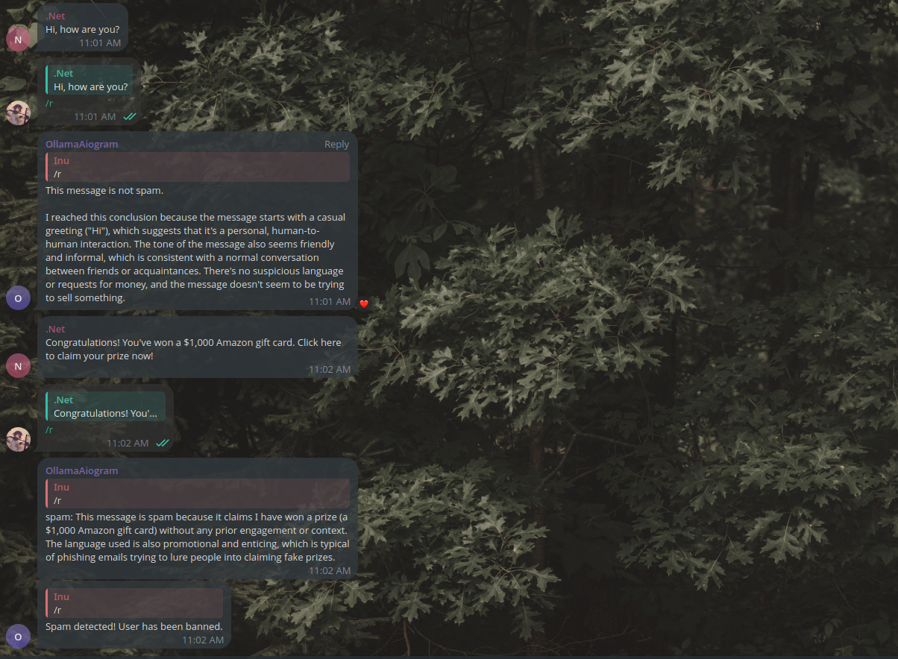

# OllamaSpam-telegram
> "A Telegram bot for public or private groups, it uses the Ollama API to differentiate a message from spam."

<p align="center">
  
</p>

# Commands
/r - The main and only function for working with API. To make it work you need to reply to a message with the /r command.

/start - Just printing the welcome message.

# Install 
✓ Install latest [Python](https://python.org/downloads)

✓ Clone Repository
```
git clone https://github.com/FeliGcc/OllamaSpam-telegram/
```
✓ Install aiogram 3.14.0
```
pip install aiogram
```
✓Run bot
```
python main.py
```
# Subject to change
`TOKEN` - Need to change to your TOKEN, [how do I get it?](https://core.telegram.org/bots/tutorial#obtain-your-bot-token). The token should be placed in the config folder, in the conf.py file.

`timeout` - The comments to the request.py function and the /r command specify what is responsible for what.

`modelname` - Change to the name of your model. In my case I used llama3.2 with modified [modelfile](https://github.com/ollama/ollama/blob/main/docs/modelfile.md) for specific answers: spam or not.

## The code used 
[Ollama](https://github.com/ollama/ollama/tree/main)

[Aiogram](https://github.com/aiogram/aiogram)

## Thanks
[API request function](https://github.com/ruecat/ollama-telegram/blob/main/bot/func/interactions.py)

